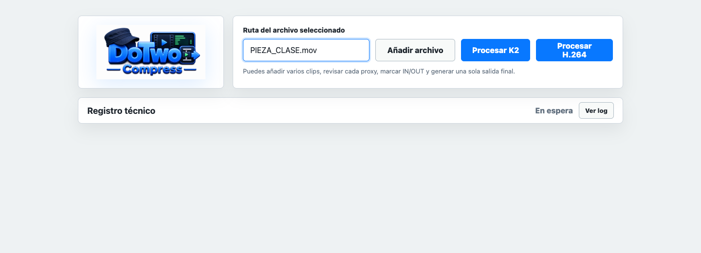

# DoTwo Compress

App local para convertir videos de alumnos a un MOV XDCAM EX 1080i50 compatible con el servidor Grass Valley K2 del plato, o a un MOV H.264 1080p ligero y compatible.

La identidad de producto queda como **DoTwo Compress**, siguiendo la linea visual de DoTwo Teleprompter: azul brillante, detalle de gorra y barra de progreso verde. La cabecera de la app usa el logo horizontal; el icono cuadrado queda reservado para Dock/Finder y builds empaquetadas.



## Licencia y atribución

DoTwo Compress se publica bajo Apache-2.0. Puedes usarla, modificarla y crear forks, conservando los avisos de licencia y atribución del proyecto original según `LICENSE` y `NOTICE`.

Concepto y dirección original: Domingo Moreno / DoTwo.

Consulta también `THIRD_PARTY_NOTICES.md` para dependencias como Electron y para la separación legal de FFmpeg/FFprobe.

## Distribución

Las builds actuales son ZIPs beta sin firmar ni notarizar. macOS puede mostrar avisos de seguridad al abrir artefactos descargados.

Los binarios de FFmpeg/FFprobe no se versionan en el Git público. Para preparar una build local:

```bash
npm ci
npm run fetch:ffmpeg
npm run check
```

El siguiente paso previsto para publicación estable es firma con Apple Developer ID, notarización y artefactos firmados. Detalle en [Distribución](docs/DISTRIBUTION.md).

Assets base:

```text
build/brand/dotwo-compress-icon.png
build/brand/dotwo-compress-logo.png
public/assets/brand/dotwo-compress-icon.png
public/assets/brand/dotwo-compress-logo.png
```

Icono de app:

```text
build/icon.png
build/icon.icns
```

`build/icon.icns` es la version macOS declarada en `package.json` para Finder/Dock. El icono tiene fondo oscuro para evitar el bloque blanco alrededor de la marca.

## Perfil objetivo K2

- Contenedor: QuickTime MOV.
- Video: MPEG-2 `xdvc`, XDCAM EX 1080i50, 1920x1080, `yuv420p`.
- Cadencia: 25 fps entrelazado, 50 campos/s, top field first.
- Audio: PCM signed 16-bit little-endian, 48 kHz, 2 canales.
- Timecode: pista `tmcd`, por defecto `00:00:00:00`.
- Nombre de salida: ASCII, mayusculas, guiones bajos, sin espacios ni caracteres especiales.

Referencias XDCAM:

- `ok_006_CATEDRAL_PIEZA.mov`
- `ok_024_PADEL_PIEZA.mov`
- `021_CLUBDEPORTIVO_PIEZA.mov` como referencia probable pendiente de confirmar en Grass Valley.

`PIEZA_TURISMO_NEW.mov` queda marcado como no valido para el flujo final: el servidor lo acepta como H.264 MOV con PCM, pero no sirve como perfil operativo porque solo entra en un canal del servidor.

## Perfil objetivo H.264

Salida ligera y compatible para normalizar archivos de formatos y resoluciones variadas:

- Contenedor: QuickTime MOV.
- Video: H.264 `avc1`, 1920x1080 progresivo, `yuv420p`.
- Audio: AAC, 48 kHz, estereo, 160 kb/s.
- Bitrate de video: respeta el bitrate de fuente cuando es razonable, con limite superior de 8 Mb/s para controlar peso.
- Nombre de salida: ASCII, mayusculas, guiones bajos, sufijo `_H264.mov`.

## Interfaz local

### App Electron

El proyecto incluye una version Electron preparada para empaquetar como `.app`.

Builds previstas:

```bash
npm run pack:mac-arm64
npm run pack:mac-intel
npm run pack:mac-legacy
```

Para macOS 10.13 hay que usar siempre la build legacy:

```bash
npm install
npm run pack:mac-legacy
```

Mas detalles en:

```text
docs/RETOMAR_PROYECTO.md
docs/PROJECT_STATUS.md
docs/INFORME_TECNICO_APP.md
docs/BUILD_MATRIX.md
docs/BINARY_DEPENDENCIES.md
docs/REPOSITORY_GUIDE.md
docs/ELECTRON_LEGACY_10_13.md
docs/HOJA_DE_RUTA.md
docs/ROADMAP_EDICION_BASICA.md
docs/MANIFIESTO_BETA_0_1_6.md
```

Los binarios internos se preparan localmente con:

```bash
npm run fetch:ffmpeg
```

El script descarga y verifica las rutas:

```text
vendor/ffmpeg/darwin-x64/ffmpeg
vendor/ffmpeg/darwin-x64/ffprobe
vendor/ffmpeg/darwin-arm64/ffmpeg
vendor/ffmpeg/darwin-arm64/ffprobe
```

La build legacy macOS 10.13 usa `darwin-x64`. La build Apple Silicon usa `darwin-arm64`, actualmente con minimo macOS 12.0 para FFmpeg/FFprobe.

Flujo de trabajo en la app Electron:

1. `Añadir archivo` permite cargar uno o varios videos en una cola.
2. Cada video se copia a un temporal local de la app.
3. La app comprueba cada copia local con `ffprobe`.
4. La app crea siempre un proxy MP4 ligero por clip para revision interna.
5. La pantalla muestra un reproductor del proxy seleccionado y un inspector con semaforo, datos de origen y alertas.
6. Desde el reproductor se puede marcar `IN` y `OUT` para recortar colas antes de procesar.
7. Si hay varios clips, se pueden seleccionar, ordenar, quitar y recortar de forma independiente.
8. `Procesar K2` y `Procesar H.264` se habilitan solo cuando todos los clips de la cola estan listos.
9. La conversion elegida lee desde temporales locales y muestra una barra de progreso limpia.
10. `Guardar procesado` permite exportar el MOV final, por defecto junto al primer original como `NOMBRE_VALIDADO.mov`, `NOMBRE_H264.mov`, `NOMBRE_MONTAJE_VALIDADO.mov` o `NOMBRE_MONTAJE_H264.mov`.

Si la fuente no es 1920x1080, la app avisa de que se ajustara a 1080i para K2 o 1080p para H.264. Si detecta video vertical, avisa y lo compone en horizontal: video centrado delante y el mismo video ampliado/desenfocado como fondo.

El inspector esta pensado como lectura pedagogica para alumnos y diagnostico rapido para tecnicos. Marca avisos cuando detecta resoluciones no 1920x1080, video vertical, FPS fuera de 25/50, posible frame rate variable, codecs lentos o poco comunes, bitrates muy altos, archivos grandes, audio ausente, audio fuera de 48 kHz o numero de canales distinto de estereo.

Si no se marca `IN` ni `OUT`, se procesa el archivo completo. Si se marca solo `IN`, se procesa desde ese punto hasta el final. Si se marca solo `OUT`, se procesa desde el inicio hasta ese punto.

En montajes multiarchivo, la app normaliza cada clip por separado y luego crea una salida unica. En H.264 concatena segmentos ya compatibles por copia. En K2 re-encodea la salida final desde segmentos normalizados para conservar `25/1`, orden audio/video y pista `tmcd` validos.

El log de FFmpeg queda oculto por defecto en `Registro tecnico` y se despliega solo cuando un tecnico necesite diagnosticar un problema. La cola se limpia con `Limpiar cola` o al cerrar la app. Los temporales internos se guardan en `~/Library/Application Support/dotwo-compress/staging` y desde la beta 0.1.6 se limpian al abrir, cerrar, iniciar nueva sesion y limpiar cola.

### Modo web local

Con doble clic:

```text
abrir_interfaz.command
```

Por terminal:

```bash
cd "/Users/dotwo/repos/apps/DoTwo_Compress"
node server.mjs
```

Abrir:

```text
http://127.0.0.1:8787
```

Pegar la ruta absoluta del archivo original y pulsar `Procesar`. La salida se crea en la misma carpeta que el original con sufijo `_VALIDADO.mov`.

Tambien se puede usar el boton `Cargar archivo`, que abre el selector nativo de macOS y rellena la ruta real del archivo.

Ejemplo:

```text
/Users/dotwo/Desktop/colasT2.mov
```

Salida esperada:

```text
/Users/dotwo/Desktop/COLAST2_VALIDADO.mov
```

Si ya existe una salida con ese nombre, se crea una variante numerada, por ejemplo `_001`.

## Uso por terminal

Convertir y dejar la salida junto al original:

```bash
scripts/transcode_xdcam_ex_mov.sh "/ruta/al/video.mov"
```

Convertir indicando salida:

```bash
scripts/transcode_xdcam_ex_mov.sh "/ruta/al/video.mov" "/ruta/salida/VIDEO_VALIDADO.mov"
```

Convertir a H.264 MOV 1080p:

```bash
scripts/transcode_h264_mov.sh "/ruta/al/video.mov"
```

Convertir a H.264 indicando salida:

```bash
scripts/transcode_h264_mov.sh "/ruta/al/video.mov" "/ruta/salida/VIDEO_H264.mov"
```

Crear proxy ligero de revision:

```bash
scripts/create_review_proxy.sh "/ruta/al/video.mov" "/ruta/salida/REVIEW_PROXY.mp4"
```

Validar salida:

```bash
scripts/validate_against_reference.sh "/ruta/salida/VIDEO_VALIDADO.mov"
```

Analizar archivo:

```bash
scripts/analyze_file.sh "/ruta/al/video.mov"
```

Analizar referencia:

```bash
scripts/analyze_reference.sh "/ruta/referencia.mov"
```

## Carpeta caliente

```bash
BASE="/Users/dotwo/VideoTranscoder" scripts/watch_folder.sh
```

Estructura creada:

```text
/Users/dotwo/VideoTranscoder/
├── ENTRADA/
├── PROCESANDO/
├── SALIDA_GRASSVALLEY/
├── PROCESADOS_ORIGINALES/
├── ERROR/
└── LOGS/
```

## Politica de imagen

Por defecto se usa `pad`, para no cortar contenido:

```bash
PAD_OR_CROP=pad scripts/transcode_xdcam_ex_mov.sh "/ruta/al/video.mov"
```

Para llenar 16:9 recortando:

```bash
PAD_OR_CROP=crop scripts/transcode_xdcam_ex_mov.sh "/ruta/al/video.mov"
```

Si el video es vertical, tanto K2 como H.264 ignoran barras negras simples y componen una salida horizontal 16:9 con el video centrado sobre una copia ampliada y desenfocada del mismo video.

## Prueba definitiva

La validacion tecnica no sustituye la prueba real. Un archivo queda aprobado cuando:

- ingiere en Grass Valley sin error;
- aparece con duracion correcta;
- reproduce sin saltos;
- el orden de campos es correcto;
- el audio sale por los canales esperados;
- no hay drift audio/video;
- funciona dentro de una playlist real.

## Audio PCM QuickTime

Compressor escribe el audio PCM con tag QuickTime `lpcm`. FFmpeg, aunque se le fuerce el tag, puede dejarlo como `sowt` en el archivo final. En las pruebas reales Grass Valley K2 ha aceptado ese audio, asi que la validacion considera `lpcm` y `sowt` como validos siempre que el audio sea PCM signed 16-bit little-endian, 48 kHz, estereo.
